Source purpose-built functions to load and validate the data, the
experimental design, and the statistical inference results for our focus
terms. Then call them.


```r
source("helper01_load-counts.r")
source("helper02_load-exp-des.r")
source("helper03_load-focus-statinf.r")

x <- load_counts()
str(x, list.len = 8) # 'data.frame':  65609 obs. of  24 variables:
```

```
## 'data.frame':	65609 obs. of  24 variables:
##  $ H898C1: num  9450.8 85.7 136.4 639.5 57.1 ...
##  $ H898C2: num  7777.8 70.8 98.7 550.2 49.9 ...
##  $ H898C3: num  7718.5 132.9 144 472.2 51.5 ...
##  $ H898C4: num  8283.8 122.6 134.5 488.4 50.9 ...
##  $ H898G1: num  8717.3 99.9 121.4 422.3 60.1 ...
##  $ H898G2: num  8209.8 99.9 167.9 420 49.8 ...
##  $ H898G3: num  6860.8 68.1 123 411.6 36.8 ...
##  $ H898G4: num  5362.4 98.3 62.2 291.4 46.6 ...
##   [list output truncated]
```

```r
expDes <- load_expDes()
str(expDes) # 'data.frame':  24 obs. of  6 variables:
```

```
## 'data.frame':	24 obs. of  6 variables:
##  $ sample: chr  "H898C1" "H898C2" "H898C3" "H898C4" ...
##  $ gType : Factor w/ 2 levels "Q903susc","H898res": 2 2 2 2 2 2 2 2 2 2 ...
##  $ txCode: Factor w/ 3 levels "C","W","G": 1 1 1 1 3 3 3 3 2 2 ...
##  $ tx    : Factor w/ 3 levels "Control","Wound",..: 1 1 1 1 3 3 3 3 2 2 ...
##  $ bioRep: int  1 2 3 4 1 2 3 4 1 2 ...
##  $ grp   : chr  "H898res.Control" "H898res.Control" "H898res.Control" "H898res.Control" ...
```

```r
sidf <- load_focus_statInf()
str(sidf) # 'data.frame':  328045 obs. of  9 variables:
```

```
## 'data.frame':	328045 obs. of  9 variables:
##  $ contig    : Factor w/ 65609 levels "WPW_Inoculation_Trinity_C500_comp100267_c0_seq1",..: 1 2 3 4 5 6 7 8 9 10 ...
##  $ focus_term: Factor w/ 5 levels "weevil","gTypeH898res_all",..: 1 1 1 1 1 1 1 1 1 1 ...
##  $ logFC     : num  0.2771 -0.0915 0.97 -0.0255 0.0537 ...
##  $ AveExpr   : num  6.583 0.41 0.381 2.7 -0.243 ...
##  $ t         : num  2.579 -0.207 2.22 -0.107 0.11 ...
##  $ F         : num  NA NA NA NA NA NA NA NA NA NA ...
##  $ P.Value   : num  0.0176 0.8379 0.0377 0.9159 0.9138 ...
##  $ adj.P.Val : num  0.145 0.943 0.22 0.972 0.971 ...
##  $ B         : num  -4.24 -6.05 -3.88 -6.6 -5.91 ...
```

Explore the distribution of the estimated "weevil" effect of interest, i.e.
the difference between the interaction terms


```r
p <- ggplot(subset(sidf, focus_term == "weevil"), aes(x = logFC))
p + geom_histogram()
p + geom_density()
```

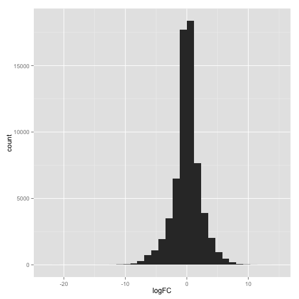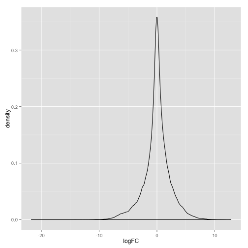

Explore the distribution of estimates for the various effects of interest.
Note: one facet will be blank, corresponding to the test whether all terms
involving genotype are equal to zero, since there is no single estimate that
is appropriate to show.


```r
p <- ggplot(sidf, aes(x = logFC))
p + geom_histogram() + facet_wrap( ~ focus_term)
p + geom_density(aes(colour = focus_term))
```

```
## Warning: Removed 65609 rows containing non-finite values (stat_density).
```

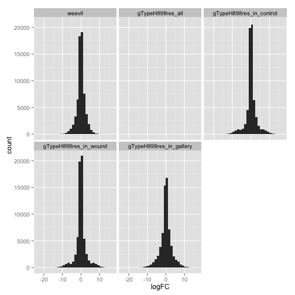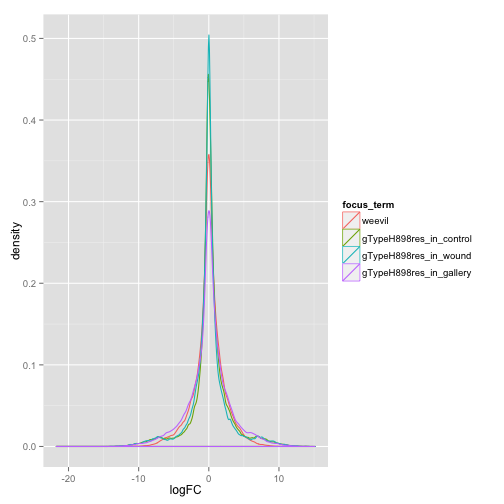

Explore the distribution of t statistics for the various effects of interest.
Note: one facet will be blank, corresponding to the test whether all terms 
involving genotype are equal to zero, since that is addressed by an F
statistic instead.


```r
p <- ggplot(sidf, aes(x = t))
p + geom_histogram() + facet_wrap( ~ focus_term)
p + geom_density(aes(colour = focus_term))
```

```
## Warning: Removed 65609 rows containing non-finite values (stat_density).
```

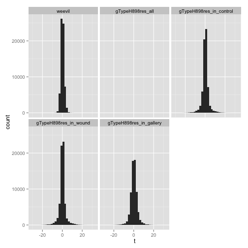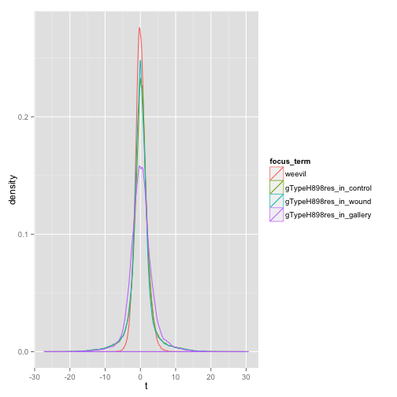

Explore the distribution of p-values for the various effects of interest. 
Note: this works same for all effects of interest.
For each focus term, estimate pi0 = the proportion of null contigs (note: the
authors of the fdrtool package use the nonstandard term eta0)


```r
(pi0 <- ddply(sidf, ~ focus_term, function(z) {
  fdr_result <- fdrtool(z$P.Value, statistic = "pvalue",
                        plot = FALSE, verbose = FALSE)
  return(fdr_result$param[1, "eta0"])  
}))
```

```
##                focus_term   eta0
## 1                  weevil 0.6939
## 2        gTypeH898res_all 0.2873
## 3 gTypeH898res_in_control 0.5900
## 4   gTypeH898res_in_wound 0.6183
## 5 gTypeH898res_in_gallery 0.4066
```

```r
p <- ggplot(sidf, aes(x = P.Value))
p + geom_histogram() + facet_wrap( ~ focus_term)
p + geom_density(aes(colour = focus_term))
```

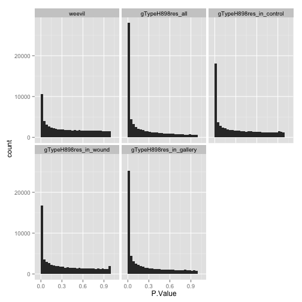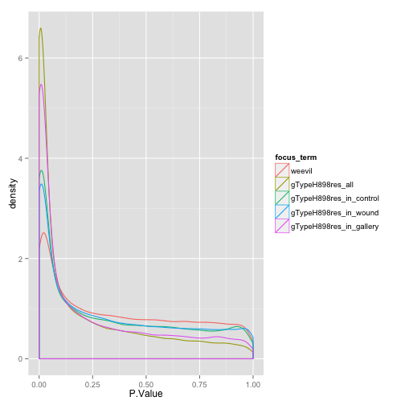

Explore the distribution of Benjamini-Hockberg adjusted p-values for the
various effects of interest. Note: this works same for all effects of
interest.


```r
p <- ggplot(sidf, aes(x = adj.P.Val))
p + geom_histogram() + facet_wrap( ~ focus_term)
p + geom_density(aes(colour = focus_term))
```

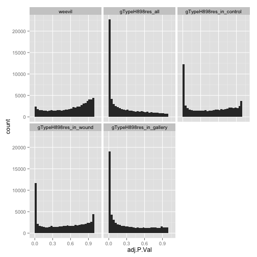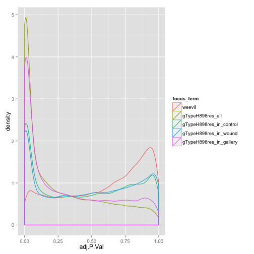

Source function to extract and tidy count data


```r
source("helper04_extract-and-tidy.r")
```

Find the top hits w/r/t genotype effects


```r
y <- subset(sidf, focus_term == "gTypeH898res_all")
hit_sidf_row <- with(y, which(rank(P.Value) < 5))
y[hit_sidf_row, ]
```

```
##                                                 contig       focus_term
## 77399  WPW_Inoculation_Trinity_C500_comp395276_c0_seq3 gTypeH898res_all
## 96863  WPW_Inoculation_Trinity_C500_comp422801_c0_seq3 gTypeH898res_all
## 102468 WPW_Inoculation_Trinity_C500_comp426363_c0_seq4 gTypeH898res_all
## 124054 WPW_Inoculation_Trinity_C500_comp434982_c0_seq2 gTypeH898res_all
##        logFC  AveExpr  t     F   P.Value adj.P.Val  B
## 77399     NA -1.12092 NA 719.5 3.539e-21 7.740e-17 NA
## 96863     NA -0.54683 NA 734.7 2.851e-21 7.740e-17 NA
## 102468    NA -1.19350 NA 615.2 1.776e-20 2.913e-16 NA
## 124054    NA -0.08361 NA 913.4 3.016e-22 1.979e-17 NA
```

```r
hit_contig <- y$contig[hit_sidf_row]

jDat <- extract_and_tidy(hit_contig, x, expDes)
str(jDat)
```

```
## 'data.frame':	96 obs. of  8 variables:
##  $ sample: chr  "H898C1" "H898C2" "H898C3" "H898C4" ...
##  $ gType : Factor w/ 2 levels "Q903susc","H898res": 2 2 2 2 2 2 2 2 2 2 ...
##  $ txCode: Factor w/ 3 levels "C","W","G": 1 1 1 1 3 3 3 3 2 2 ...
##  $ tx    : Factor w/ 3 levels "Control","Wound",..: 1 1 1 1 3 3 3 3 2 2 ...
##  $ bioRep: int  1 2 3 4 1 2 3 4 1 2 ...
##  $ grp   : chr  "H898res.Control" "H898res.Control" "H898res.Control" "H898res.Control" ...
##  $ contig: Factor w/ 4 levels "comp395276_c0_seq3",..: 1 1 1 1 1 1 1 1 1 1 ...
##  $ count : num  2479 2110 1980 2320 2611 ...
```

```r
p <- ggplot(jDat, aes(x = count, y = gType, colour = tx))
p + geom_jitter(position = position_jitter(height = .15)) +
  facet_wrap(~ contig, scales="free_x")
```

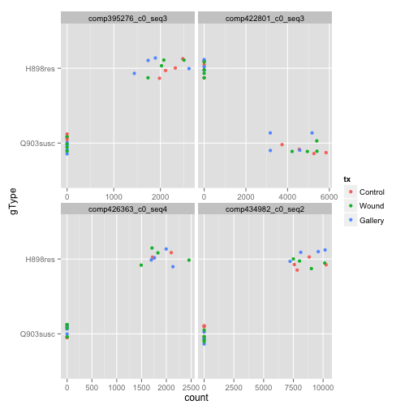 

Find the top hits w/r/t the weevil effect


```r
y <- subset(sidf, focus_term == "weevil")
hit_sidf_row <- with(y, which(rank(P.Value) < 7))
y[hit_sidf_row, ]
```

```
##                                                 contig focus_term logFC
## 11017  WPW_Inoculation_Trinity_C500_comp394131_c0_seq1     weevil 2.611
## 15474  WPW_Inoculation_Trinity_C500_comp403101_c0_seq1     weevil 7.188
## 16087  WPW_Inoculation_Trinity_C500_comp404180_c0_seq2     weevil 7.605
## 45039  WPW_Inoculation_Trinity_C500_comp430409_c0_seq1     weevil 8.993
## 51508  WPW_Inoculation_Trinity_C500_comp432937_c2_seq5     weevil 7.199
## 53268 WPW_Inoculation_Trinity_C500_comp433521_c0_seq12     weevil 7.617
##       AveExpr      t  F   P.Value adj.P.Val     B
## 11017  5.2634 11.223 NA 2.746e-10 1.222e-05 13.78
## 15474 -0.6265 10.403 NA 1.060e-09 1.739e-05 10.07
## 16087 -0.7358 10.901 NA 4.625e-10 1.222e-05 10.46
## 45039  1.2473 10.786 NA 5.588e-10 1.222e-05 11.06
## 51508 -4.6682 10.062 NA 1.900e-09 2.384e-05  6.63
## 53268 -4.4140  9.982 NA 2.180e-09 2.384e-05  6.70
```

```r
hit_contig <- y$contig[hit_sidf_row]

jDat <- extract_and_tidy(hit_contig, x, expDes)
str(jDat)
```

```
## 'data.frame':	144 obs. of  8 variables:
##  $ sample: chr  "H898C1" "H898C2" "H898C3" "H898C4" ...
##  $ gType : Factor w/ 2 levels "Q903susc","H898res": 2 2 2 2 2 2 2 2 2 2 ...
##  $ txCode: Factor w/ 3 levels "C","W","G": 1 1 1 1 3 3 3 3 2 2 ...
##  $ tx    : Factor w/ 3 levels "Control","Wound",..: 1 1 1 1 3 3 3 3 2 2 ...
##  $ bioRep: int  1 2 3 4 1 2 3 4 1 2 ...
##  $ grp   : chr  "H898res.Control" "H898res.Control" "H898res.Control" "H898res.Control" ...
##  $ contig: Factor w/ 6 levels "comp394131_c0_seq1",..: 1 1 1 1 1 1 1 1 1 1 ...
##  $ count : num  4652 4331 5233 4591 3906 ...
```

```r
p <- ggplot(jDat, aes(x = count, y = gType, colour = tx))
p + geom_jitter(position = position_jitter(height = .15)) +
  facet_wrap(~ contig, scales="free_x")
```

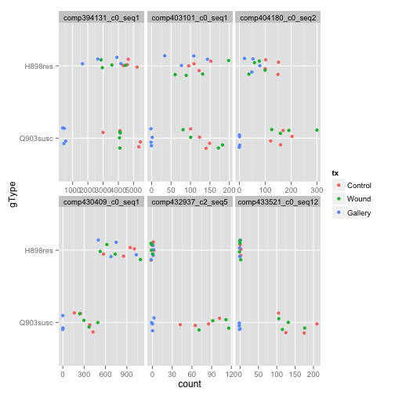 

Find the top hits w/r/t genotype in the control condition specifically


```r
y <- subset(sidf, focus_term == "gTypeH898res_in_control")
hit_sidf_row <- with(y, which(rank(P.Value) < 10))
y[hit_sidf_row, ]
```

```
##                                                 contig
## 143008 WPW_Inoculation_Trinity_C500_comp395276_c0_seq3
## 155612 WPW_Inoculation_Trinity_C500_comp416779_c0_seq5
## 162472 WPW_Inoculation_Trinity_C500_comp422801_c0_seq3
## 168077 WPW_Inoculation_Trinity_C500_comp426363_c0_seq4
## 168441 WPW_Inoculation_Trinity_C500_comp426596_c1_seq6
## 171207 WPW_Inoculation_Trinity_C500_comp428024_c1_seq2
## 178583 WPW_Inoculation_Trinity_C500_comp431369_c0_seq5
## 189663 WPW_Inoculation_Trinity_C500_comp434982_c0_seq2
## 190671 WPW_Inoculation_Trinity_C500_comp435223_c1_seq8
##                     focus_term   logFC  AveExpr      t  F   P.Value
## 143008 gTypeH898res_in_control  11.953 -1.12092  27.10 NA 1.016e-17
## 155612 gTypeH898res_in_control   4.984  2.99999  23.05 NA 2.673e-16
## 162472 gTypeH898res_in_control -13.385 -0.54683 -27.23 NA 9.239e-18
## 168077 gTypeH898res_in_control  11.675 -1.19350  24.79 NA 6.162e-17
## 168441 gTypeH898res_in_control -13.271 -0.65115 -22.97 NA 2.861e-16
## 171207 gTypeH898res_in_control  10.692 -1.80359  24.15 NA 1.043e-16
## 178583 gTypeH898res_in_control  12.160 -1.02094  23.82 NA 1.378e-16
## 189663 gTypeH898res_in_control  13.907 -0.08361  30.24 NA 1.100e-18
## 190671 gTypeH898res_in_control -10.877 -1.91317 -23.01 NA 2.772e-16
##        adj.P.Val     B
## 143008 2.223e-13 20.57
## 155612 2.086e-12 26.28
## 162472 2.223e-13 20.65
## 168077 1.011e-12 19.97
## 168441 2.086e-12 19.46
## 171207 1.369e-12 19.72
## 178583 1.507e-12 19.70
## 189663 7.219e-14 21.28
## 190671 2.086e-12 19.35
```

```r
hit_contig <- y$contig[hit_sidf_row]

jDat <- extract_and_tidy(hit_contig, x, expDes)
str(jDat)
```

```
## 'data.frame':	216 obs. of  8 variables:
##  $ sample: chr  "H898C1" "H898C2" "H898C3" "H898C4" ...
##  $ gType : Factor w/ 2 levels "Q903susc","H898res": 2 2 2 2 2 2 2 2 2 2 ...
##  $ txCode: Factor w/ 3 levels "C","W","G": 1 1 1 1 3 3 3 3 2 2 ...
##  $ tx    : Factor w/ 3 levels "Control","Wound",..: 1 1 1 1 3 3 3 3 2 2 ...
##  $ bioRep: int  1 2 3 4 1 2 3 4 1 2 ...
##  $ grp   : chr  "H898res.Control" "H898res.Control" "H898res.Control" "H898res.Control" ...
##  $ contig: Factor w/ 9 levels "comp395276_c0_seq3",..: 1 1 1 1 1 1 1 1 1 1 ...
##  $ count : num  2479 2110 1980 2320 2611 ...
```

```r
p <- ggplot(subset(jDat, tx == "Control"),
            aes(x = count, y = gType))
p + geom_jitter(position = position_jitter(height = .15)) +
  facet_wrap(~ contig, scales="free_x")
```

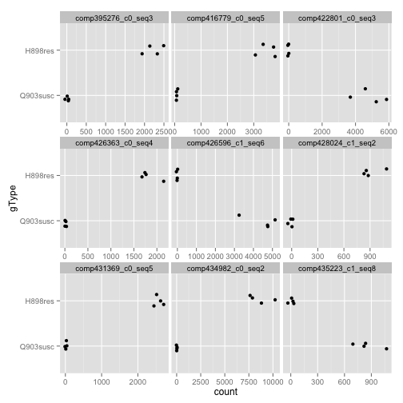 

