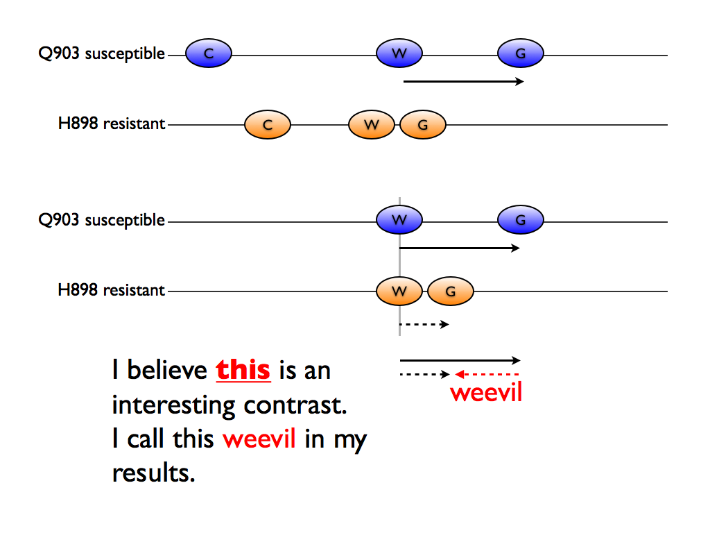
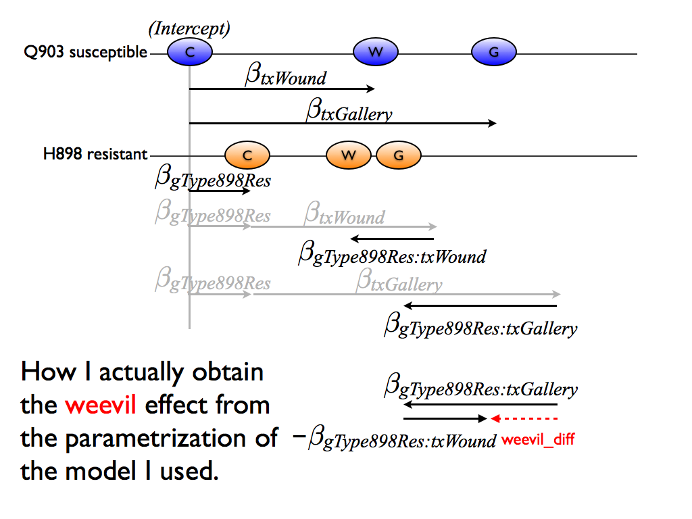

We discussed and chose a model in this document: [model-exposition.md](../model-exposition/model-exposition.md). Recall the fictional example we used for illustration:

We concluded there were two main interests:

  * The differences between the resistant H898 genotype and the susceptible Q903 genotype in each of the 3 conditions -- but, especially in the control condition
  * The differences in the expression change associated with gallery vs wounding between the resistant H898 genotype and the susceptible Q903 genotype
  
For reference, here is the model and parametrization we actually used:

From this, we can extract parameter estimates for the various parameters of interest. We can test whether these parameters are equal to zero, individually, and as a group, which gives rise to test statistics and then p-values.

The inferential results for the six parameters of our model are given in [results/limma-results-model-terms.tsv](../results/limma-results-model-terms.tsv), which is quite large. There is one row for every contig * parameter combination. Here are the variables or columns:

  * contig
  * logFC = parameter estimate
  * AveExpr *(ignoring)*
  * t = t statistic for H0: this parameter = 0
  * P.Value = associated p-value
  * adj.P.Val = Benjamini-Hochberg adjusted p-value, a.k.a. q-value, which is aimed at controlling the false discovery rate (FDR)
  * B *(ignoring)*

Now let's focus on the parameters, groups of parameters, and contrasts we care most about. First, recall the effect of genotype within each condition and globally:

There are 3 individual parameters here, plus the set of all 3 together.

Second, recall the differential effect of gallery vs wounding between the two genotypes -- the so-called *weevil* effect:

Though it may be hard to believe, that effect is easy to extract from our model but simply subtracting one interaction effect from the other:

The estimates (where well-defined), test statistics, p-values, etc. for these parameters, groups of parameters, and contrast are given in [results/limma-results-focus-terms.tsv](../results/limma-results-focus-terms.tsv). The variables or columns are almost identical to those described above but with two wrinkles:

  * Since one of the tests we conduct is whether __all__ the genotype terms are simulaneously equal to zero, the `logFC` field is NA in these rows, since there is no single, relevant estimate.
  * For the same reason, the test in that case is an F test instead of a t test.

Hopefully these figures provide a decent explanation of the model and of the results that come out of it. The descriptions above should also explain the basic structure of the two main results files.

A very preliminary and rudimentary exploration of the results is carried out in `analysis/04_explore-dea-results.r`, which can be viewed in report form at [analysis/04_explore-dea-results.md](04_explore-dea-results.md).
