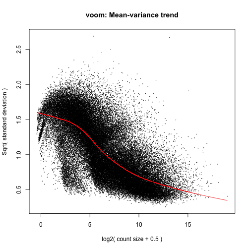

While doing the main DEA, I ran into problems with the column names of the 
design matrix. Initially, I let them arise naturally, from my factor names, 
levels, and model form. But then you get a fatal error from 
`makeContrasts()`, because at some point they apparently need to be valid R 
object names. In some of my informal fussing around, I altered the model 
matrix column names enough to satisfy `makeContrasts()`, but then had trouble
getting what I wanted from `topTable()`. Specifically, I had trouble 
specifying the `coef` or term I wanted to see inference for. Here is where I 
document the initial problem and the solution I've settled on.

`spin()` this "by hand" with `precious = TRUE` to ensure markdown is
preserved.


```r
library(limma)
library(edgeR)
library(testthat) # facilitate tests that will catch changes on re-analysis
```

## Differential Expression Analysis on Sitka Spruce Weevil 
## Experiment with limma + voom
Load counts from Sailfish. Each row represents a contig.


```r
filteredSailfishCounts <- # take a few moments
  read.delim("../data/consolidated-filtered-Sailfish-results.txt")
str(filteredSailfishCounts) # 'data.frame':  65609 obs. of  24 variables:
```

```
## 'data.frame':	65609 obs. of  24 variables:
##  $ H898C1: num  9450.8 85.7 136.4 639.5 57.1 ...
##  $ H898C2: num  7777.8 70.8 98.7 550.2 49.9 ...
##  $ H898C3: num  7718.5 132.9 144 472.2 51.5 ...
##  $ H898C4: num  8283.8 122.6 134.5 488.4 50.9 ...
##  $ H898G1: num  8717.3 99.9 121.4 422.3 60.1 ...
##  $ H898G2: num  8209.8 99.9 167.9 420 49.8 ...
##  $ H898G3: num  6860.8 68.1 123 411.6 36.8 ...
##  $ H898G4: num  5362.4 98.3 62.2 291.4 46.6 ...
##  $ H898W1: num  9404.7 142.1 109.6 543.3 84.1 ...
##  $ H898W2: num  9101.3 107.6 129.5 458 41.8 ...
##  $ H898W3: num  9851.5 111.5 153.8 544.5 63.2 ...
##  $ H898W4: num  7321.1 107.7 93.7 468.9 49.5 ...
##  $ Q903C1: num  7487.6 114.4 90 566.3 76.1 ...
##  $ Q903C2: num  6034.8 64.6 79.8 610.8 71.9 ...
##  $ Q903C3: num  5485.3 61.1 63.2 375.2 63.9 ...
##  $ Q903C4: num  7205 86.3 139.9 536.8 72.7 ...
##  $ Q903G1: num  3663.4 107.6 54 285 61.6 ...
##  $ Q903G2: num  4476.1 82.2 32.9 466.8 61.7 ...
##  $ Q903G3: num  3301 46.2 37.6 260.1 51 ...
##  $ Q903G4: num  3152.6 48.8 24.4 258.5 27.8 ...
##  $ Q903W1: num  7629 122.1 73.9 540.1 88.9 ...
##  $ Q903W2: num  7203.3 129.9 108.2 475.7 57.9 ...
##  $ Q903W3: num  7559.9 95.2 91.4 679.5 135.9 ...
##  $ Q903W4: num  6218.6 93.9 127.5 436.7 58.4 ...
```

```r
test_that("filtered Sailfish data (still) has 65609 rows upon import",
          expect_equal(65609, nrow(filteredSailfishCounts)))
test_that("Sailfish data (still) has data for exactly 24 samples",
          expect_equal(24, ncol(filteredSailfishCounts)))
```

Load experimental design


```r
expDes <- read.delim("../data/White_Pine_Weevil_exp_design.tsv",
                     stringsAsFactors = FALSE)
expDes <-
  transform(expDes,
            gType = factor(gType, levels = c("Q903susc", "H898res")),
            txCode = factor(txCode, levels = c('C', 'W', 'G')),
            tx = factor(tx, levels = c("Control", "Wound", "Gallery")))
expDes$grp <-
  with(expDes, factor(grp,
                      levels = paste(levels(gType),
                                     rep(levels(tx), each = 2), sep = ".")))
str(expDes) # 'data.frame':  24 obs. of  6 variables:
```

```
## 'data.frame':	24 obs. of  6 variables:
##  $ sample: chr  "H898C1" "H898C2" "H898C3" "H898C4" ...
##  $ gType : Factor w/ 2 levels "Q903susc","H898res": 2 2 2 2 2 2 2 2 2 2 ...
##  $ txCode: Factor w/ 3 levels "C","W","G": 1 1 1 1 3 3 3 3 2 2 ...
##  $ tx    : Factor w/ 3 levels "Control","Wound",..: 1 1 1 1 3 3 3 3 2 2 ...
##  $ bioRep: int  1 2 3 4 1 2 3 4 1 2 ...
##  $ grp   : Factor w/ 6 levels "Q903susc.Control",..: 2 2 2 2 6 6 6 6 4 4 ...
```

```r
test_that("design matrix (still) has 24 rows upon import",
          expect_equal(24, nrow(expDes)))
```

Load counts into DGEList object from edgeR package.


```r
y <- DGEList(counts = filteredSailfishCounts, group = expDes$grp)
```

TMM Normalization by Depth


```r
y <- calcNormFactors(y)
```

make model matrix


```r
#modMat <- model.matrix(~ tx/gType - 1, expDes)
modMat <- model.matrix(~ gType * tx, expDes)

colnames(modMat)
```

```
## [1] "(Intercept)"            "gTypeH898res"          
## [3] "txWound"                "txGallery"             
## [5] "gTypeH898res:txWound"   "gTypeH898res:txGallery"
```

voom transformation


```r
v <- voom(y, modMat, plot = TRUE) # take a couple moments
```

 

Linear modelling


```r
fit <- lmFit(v, modMat)
```

create contrast matrix to take difference of interaction terms


```r
cont_matrix <-
  makeContrasts(weevil = gTypeH898res:txGallery - gTypeH898res:txWound,
                levels = modMat) # here's our first fatal error
```

```
## Warning: Renaming (Intercept) to Intercept
```

```
## Error: The levels must by syntactically valid names in R, see
## help(make.names).  Non-valid names:
## gTypeH898res:txWound,gTypeH898res:txGallery
```

The `:` is not allowed in R object names. This seems perverse, given that 
they will naturally occur in interaction terms formed by model.matrix(). See 
[here](https://stat.ethz.ch/pipermail/bioconductor/2010-February/031554.html)
for confirmation that I am not just being stupid.

Let's change the column names of the model matrix and redo all the linear 
modelling bits. I'm also going to get rid of the parentheses flanking
`Intercept`.


```r
colnames(modMat)
```

```
## [1] "(Intercept)"            "gTypeH898res"          
## [3] "txWound"                "txGallery"             
## [5] "gTypeH898res:txWound"   "gTypeH898res:txGallery"
```

```r
colnames(modMat) <- gsub(":", "_", colnames(modMat))
colnames(modMat) <- gsub("[()]", "", colnames(modMat))
colnames(modMat)
```

```
## [1] "Intercept"              "gTypeH898res"          
## [3] "txWound"                "txGallery"             
## [5] "gTypeH898res_txWound"   "gTypeH898res_txGallery"
```

voom transformation


```r
v <- voom(y, modMat, plot = TRUE) # take a couple moments
```

 

Linear modelling


```r
fit <- lmFit(v, modMat)
```

create contrast matrix to take difference of interaction terms


```r
cont_matrix <-
  makeContrasts(weevil = gTypeH898res_txGallery - gTypeH898res_txWound,
                levels = modMat)
```

Put the contrasts into action and apply the Empirical Bayes moderation.


```r
fit2 <- contrasts.fit(fit, cont_matrix)
fit3 <- eBayes(fit2)
```

Pull out top hits for our term of interest


```r
tt_diff_interactions <- topTable(fit3, coef = "weevil")
head(tt_diff_interactions)
```

```
##                                                   logFC AveExpr      t
## WPW_Inoculation_Trinity_C500_comp394131_c0_seq1   2.611  5.2634 11.223
## WPW_Inoculation_Trinity_C500_comp430409_c0_seq1   8.993  1.2473 10.786
## WPW_Inoculation_Trinity_C500_comp431944_c0_seq3  -4.513  5.2795 -9.456
## WPW_Inoculation_Trinity_C500_comp407962_c0_seq1   6.127  2.7113  9.633
## WPW_Inoculation_Trinity_C500_comp404180_c0_seq2   7.605 -0.7358 10.901
## WPW_Inoculation_Trinity_C500_comp435469_c0_seq11  5.709  3.3595  9.312
##                                                    P.Value adj.P.Val     B
## WPW_Inoculation_Trinity_C500_comp394131_c0_seq1  2.746e-10 1.222e-05 13.78
## WPW_Inoculation_Trinity_C500_comp430409_c0_seq1  5.588e-10 1.222e-05 11.06
## WPW_Inoculation_Trinity_C500_comp431944_c0_seq3  5.546e-09 4.043e-05 10.82
## WPW_Inoculation_Trinity_C500_comp407962_c0_seq1  4.035e-09 3.309e-05 10.48
## WPW_Inoculation_Trinity_C500_comp404180_c0_seq2  4.625e-10 1.222e-05 10.46
## WPW_Inoculation_Trinity_C500_comp435469_c0_seq11 7.199e-09 4.723e-05 10.29
```

```r
sessionInfo()
```

```
## R version 3.1.0 (2014-04-10)
## Platform: x86_64-apple-darwin10.8.0 (64-bit)
## 
## locale:
## [1] C
## 
## attached base packages:
## [1] methods   stats     graphics  grDevices utils     datasets  base     
## 
## other attached packages:
## [1] testthat_0.8.1 edgeR_3.4.2    limma_3.18.13 
## 
## loaded via a namespace (and not attached):
## [1] digest_0.6.4   evaluate_0.5.5 formatR_0.10   knitr_1.5.33  
## [5] stringr_0.6.2  tools_3.1.0
```

