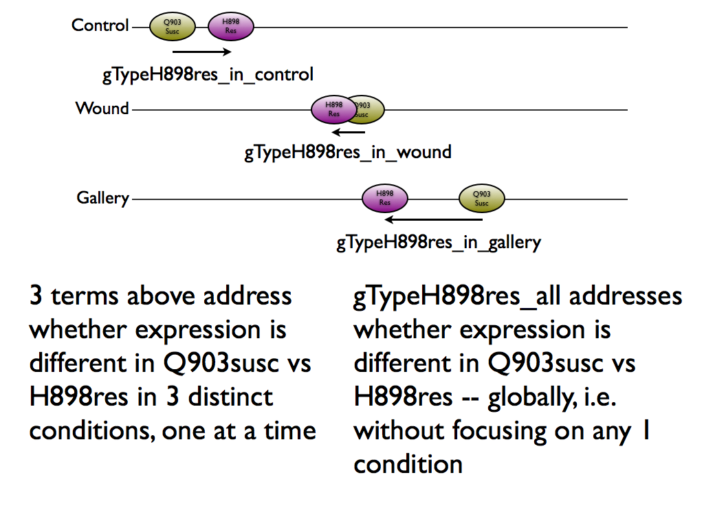
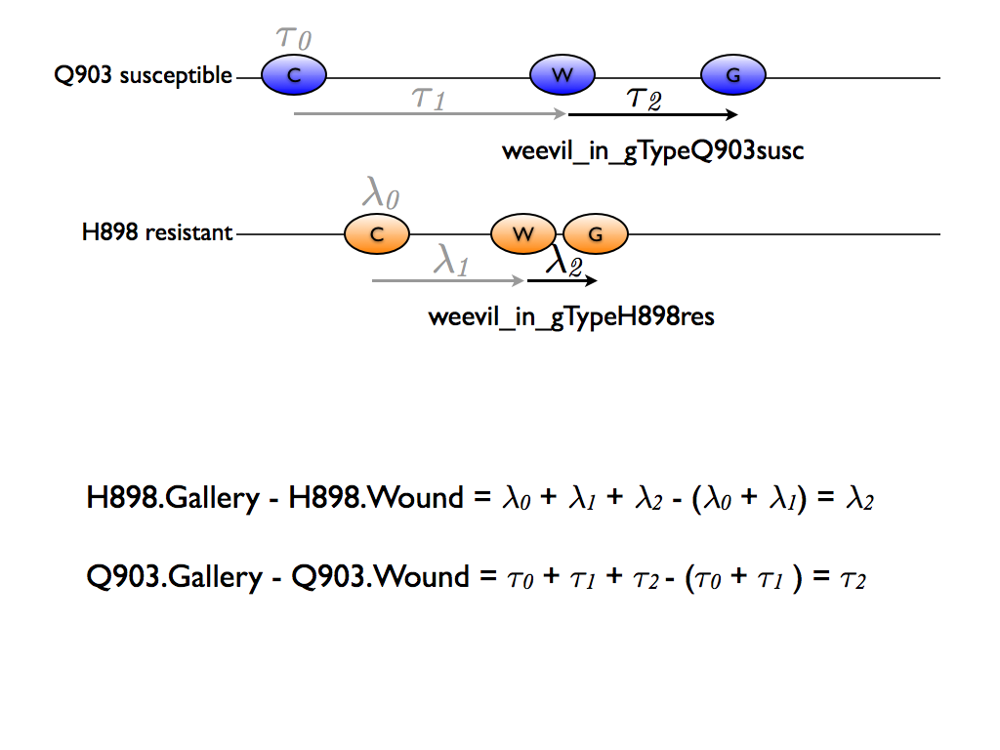
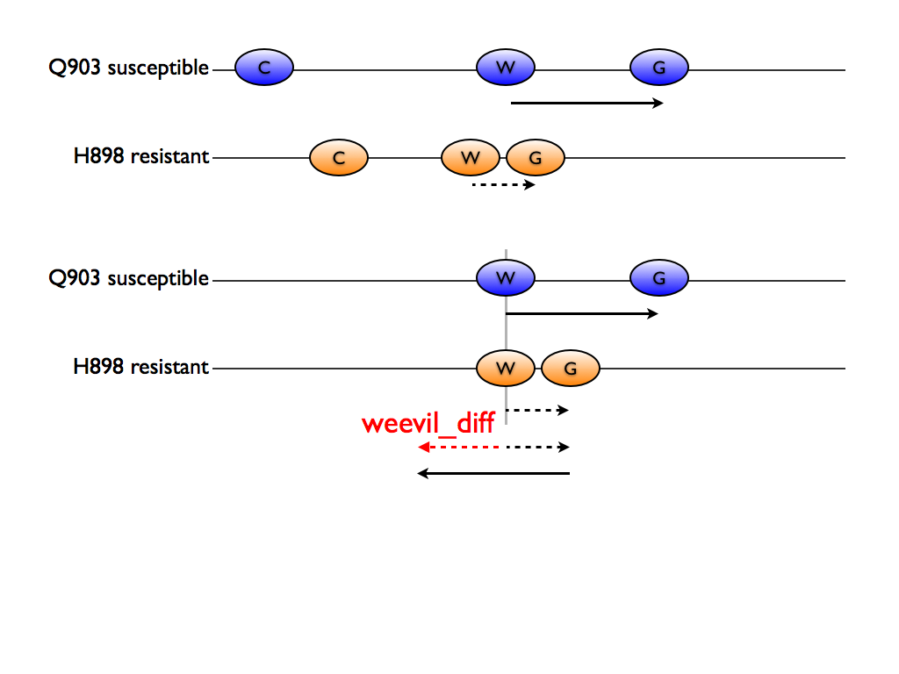
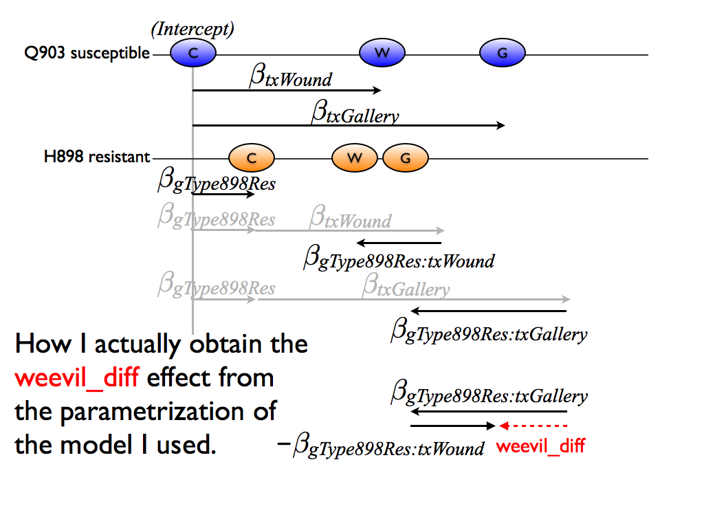

Here is a useful fictional example. Note the two views of the same set of 6 conditions: split out primarily based on genotype (top) or based on treatment (bottom). For different comparisons, different viewpoints are more advantageous.

We have concluded there are three main interests:

  * The differences between the resistant H898 genotype and the susceptible Q903 genotype in each of the 3 conditions (with special interest in the control condition).
    - This leads to estimation and inference related to each individual condition (3 terms) + inference related to all 3 at once (1 overall F test).
  * The differences in the expression change associated with gallery vs wounding in the resistant H898 genotype and in and the susceptible Q903 genotype
    - This leads to estimation and inference for each genotype (2 terms).
  * The difference between the "gallery vs. wounding" effects between the two genotypes.
    - This leads to estimation and inference for a single term.
    
Next I show the model I fit and then, further below, connect it to all the things we care about.
    
## The fitted model

The path of least resistance is to fit the linear model using a standard parametrization.
  

From this, we can extract parameter estimates for the various terms of interest. We can test whether they are equal to zero, individually, and as a group, which gives rise to test statistics and then p-values.

However, for completeness, I have committed the inferential results for the six natural parameters of the model via [results/limma-results-model-terms.tsv](../results/limma-results-model-terms.tsv), which is quite large. There is one row for every contig * parameter combination. Here are the variables or columns:

  * contig
  * model_term = identifies one of the six model parameters
  * logFC = parameter estimate
  * AveExpr *(ignoring)*
  * t = t statistic for H0: this parameter = 0
  * P.Value = associated p-value
  * adj.P.Val = Benjamini-Hochberg adjusted p-value, a.k.a. q-value, which is aimed at controlling the false discovery rate (FDR)
  * B *(ignoring)*

## Resistant H898 genotype vs. susceptible Q903 genotype

Here are the 3 comparisons of interest: resistant H898 genotype vs. susceptible Q903 genotype in each individual condition:

The figure connects visual depictions of the comparisons to the name I have used when reporting results.

__Statistical note:__ When testing if a single parameter (or term, more generally) is equal to zero, a *t*-test arises. We can also provide an estimate of that parameter. This applies to the 3 terms that contrast the two genotypes within a condition. However, when testing if 3 parameters are all equal to zero as a group, an *F* test arises and there's also no sensible estimate to report. So don't be surprised at the difference in how results get reported in those two scenarios.

## Gallery vs. wounding = weevil effects

Here are the 2 comparisons of interest: Gallery vs. Wounding in each genotype. We will call this the weevil effect.

## Difference of weevil effects

Last we consider the difference of the weevil effects in the resistant H898 genotype vs. the susceptible Q903.

Though it may be hard to believe, that effect is easy to extract from our model but simply subtracting one interaction effect from the other:

## Where to find results

As described above, straight-ahead inferential results for the six natural parameters of the fitted model are given in [results/limma-results-model-terms.tsv](../results/limma-results-model-terms.tsv).

__However__, I have also formed a specific file of results for the specific terms we are interested in. To review, here are the variables you will find:

  * contig
  * focus_term = identifies one of the terms of specific interest
  * logFC = term estimate, which can be NA if no single estimate is relevant
  * AveExpr *(ignoring)*
  * t = t statistic for H0: this parameter = 0 (used for single terms)
  * F = F statistic for H0: this parameter = 0 (used for groups of terms)
  * P.Value = associated p-value
  * adj.P.Val = Benjamini-Hochberg adjusted p-value, a.k.a. q-value, which is aimed at controlling the false discovery rate (FDR)
  * B *(ignoring)*

Here is that (extremely large!) file: [results/limma-results-focus-terms.tsv](../results/limma-results-focus-terms.tsv).

A very preliminary and rudimentary exploration of the results is carried out in `analysis/04_explore-dea-results.r`, which can be viewed in report form at [analysis/04_explore-dea-results.md](../analysis/04_explore-dea-results.md).
