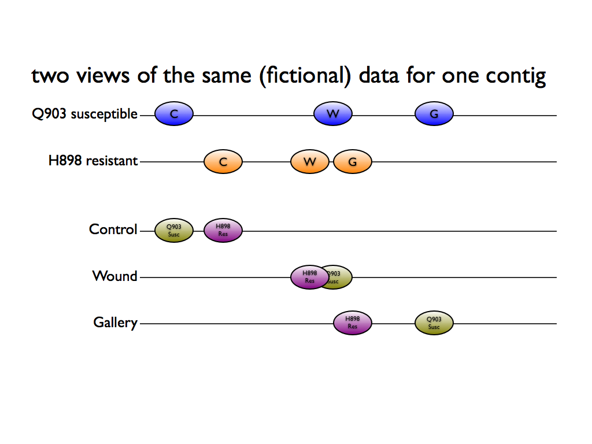
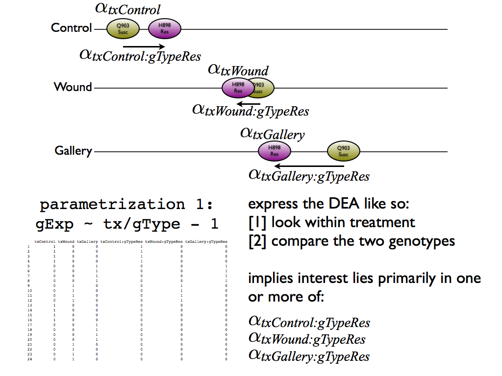
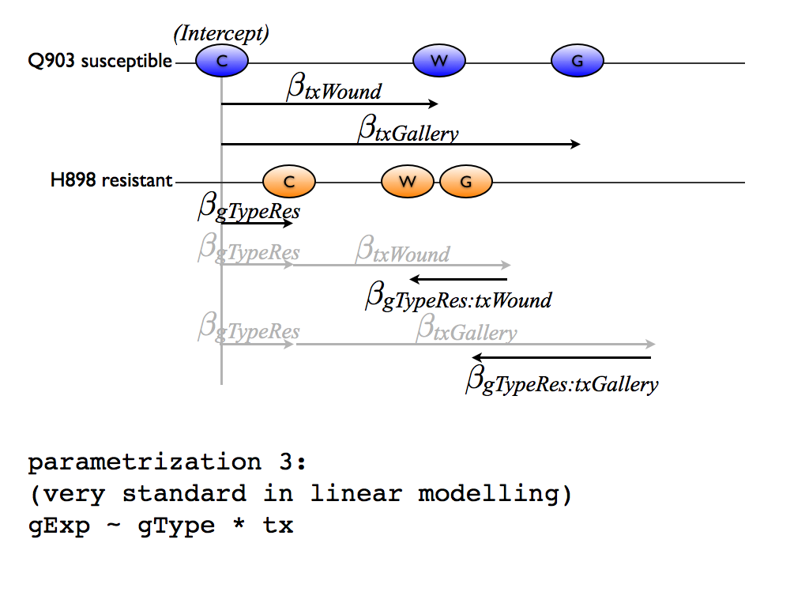
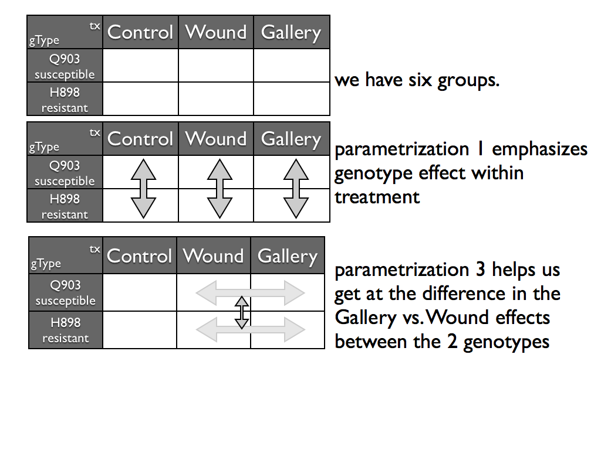

We need to decide how to parametrize our model and, within that, to specify which effects we are interested in, i.e. which effects do we want to test for equality with zero? Here JB is using written and verbal material to work out how to translate the biological question(s) into statistical ones.

From Mack's original email:

"We have 24 RNA-Seq libraries coming from 2 genotypes: Susceptible (S) and Resistance (R), and 3 treatment conditions: Control (C), Gallery (G) and Wound (W), each with biological replicates.  We are interested in comparing: 1) the differential expression for each condition between the genotypes and (e.g. susceptible-gallery vs. resistance-gallery) 2) the differential expression between the treatment condition within the genotypes (e.g. susceptible-gallery vs. susceptible-wound)."

Let's make this discussion concrete with an example.

Let's address the first question of interest: within each treatment -- especially in Control --  compare the two genotypes.

Proposal:

  * We extract estimated effects and related statistical significance quantities for all three `\alpha_{tx*:gTypeRes}` terms individually and as a group.
  * Note that Justin has greater interest in "things that are unique in H898", i.e. expression in H898 >> Q903. Suggests it may be useful to sort in a "signed" way instead of strictly on statistical significance, i.e. to put the most interesting contigs at the very beginning and very end of the table, rather than interleaved at the top.

Finally let's address the second question of interest, which Justin and Mack often call "induction".

As laid out in the above slide, I don't think the contrast Mack was computing in the draft differential expression analysis code really gets at what they want.

Here's my take, which relies on stating the model in a different way:

I think what they really want to do is to form the difference between Gallery and Wound for each genotype separately and then compare/contrast those differences. The model parametrization used above turns out to not be readily available, so I'd rather obtain the effect of interest another way.

Here is the most standard way to parametrize our model:

The model has 6 parameters, as indeed it must:

  * an intercept = expected expression in Q903 susceptible in Control treatment
  * a *main effect* for the H898 susceptible genotype
  * two *main effects* for the Wound and Control treatments
  * two *interaction effects* for the interaction between the H898 genotype and the Wound and Control treatments

Here is some hideous Keynote math showing that the difference between the interaction effects is what I believe what Justin and Mack are interested in when they talk about "induction".

Proposal:

  * We extract estimated effects and related statistical significance quantities for the difference `\alpha_{gTypeRes:Gallery} - \alpha_{gTypeRes:Wound}`.
  * Note that Justin has greater interest in "things that are unique to Gallery", i.e. expression under Gallery tx >> Wound tx. Suggests it may be useful to sort in a "signed" way instead of strictly on statistical significance, i.e. to put the most interesting contigs at the very beginning and very end of the table, rather than interleaved at the top.
  
It might be interesting to make some scatterplot matrices of various effects and contrasts.

Finally, here is another graphic thay may shed light on the model and how different parametrizations pave the way to different comparisons.

